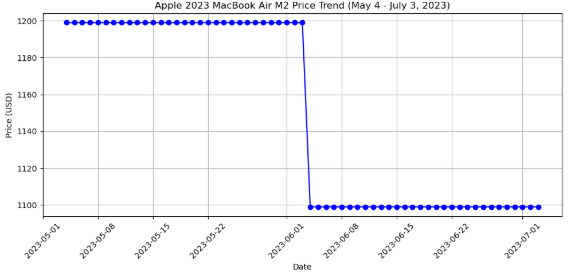

# [Amazon Web Scraper Using Python](https://aljocastro.github.io/AmazonWebScraper/)

## 📊 Project Overview
In this project, I built a Python-based Amazon price tracker that automatically monitors a product’s price. Using BeautifulSoup and Requests, the scraper connects to an specific web page, retrieves key details, cleans and structures the data. The script can run at scheduled intervals, making it a simple yet effective automation tool.

  * Data Source: Amazon product pages.
  * Libraries Used: BeautifulSoup, Requests.
  * Functionality: Web scraping, data extraction, data analysis.
  * Goal: Amazon Price Tracker to automate the process of tracking price drops for specific products.
  * Write-up: The complete walkthrough and code are published here.  
   
   
## 🚀 Result: Amazon Price Tracker
This Amazon Price Tracker is a Python automation tool that monitors Amazon product prices and sends an email alert when the price drops below a defined threshold.
It uses BeautifulSoup and Requests to scrape live product data, logs each check with a timestamp for historical tracking, and leverages smtplib to deliver instant notifications.

<ins>Key Highlights:</ins>  
  🔍 Web Scraping – Extracts product title, price, and other key details directly from Amazon product pages.  
  ⏱ Scheduled Checks – Can run at set intervals to keep price data up to date.  
  📊 Data Logging – Saves timestamps and price history, can be used for trend analysis.  
  📧 Email Alerts – Notifies you instantly when the price drops below your desired limit.  
  🛠 Tech Stack – Python, BeautifulSoup, Requests, smtplib.

<ins>Flowchart:</ins>             
                                                                      
                                    Start Price Tracker
                                             ▼
                           Send GET request to Amazon product page
                                             ▼
                               Parse HTML with BeautifulSoup 
                                             ▼
                            Extract, Clean and Transform the data 
                                             ▼
                               Load and append into a CSV file 
                                             ▼
                         Create a scheduled automated ETL procedure
                                             ▼
                                     Price < Threshold?
                                       ┌─────┴─────┐
                                      Yes          No
                                       ▼           ▼
                              ┌────────────┐   ┌─────────────────────┐
                              │ Send Email │   │ Wait & Run Again    │
                              │ Alert      │   │ (Scheduled Check)   │
                              └────────────┘   └─────────────────────┘


<ins>Write-up:</ins>  
```
 #Import libraries
 import pandas as pd  
 from bs4 import BeautifulSoup  
 import requests  
 import time  
 import datetime  
 import smtplib  
 import csv

 #Make the request and parse HTML
 def check_price():  
    URL = 'https://www.amazon.com/Apple-2023-MacBook-Laptop-chip/dp/B0C7638G25?th=1'  
    headers = {"User-Agent": "Mozilla/5.0 (Windows NT 10.0; Win64; x64) AppleWebKit/537.36 (KHTML, like Gecko) Chrome/78.0.3904.108 Safari/537.36", "Accept-Encoding":"gzip, deflate", "Accept":"text/html,application/xhtml+xml,application/xml;q=0.9,*/*;q=0.8", "DNT":"1","Connection":"close", "Upgrade-Insecure-Requests":"1"} 
    page = requests.get(URL, headers=headers)  
    soup1 = BeautifulSoup(page.content, "html.parser")  
    soup2 = BeautifulSoup(soup1.prettify(), "html.parser")  

  #Extract, Transform and Load the data  
  title = soup2.find(id='productTitle').get_text()  
  price = soup2.find(id='priceblock_ourprice').get_text()

  price = price.strip()[1:]
  title = title.strip()  
  today = datetime.date.today()

  header = ['Title', 'Price', 'Date']  
  data = [title, price, today]
  with open('AmazonWebScraperDataset.csv', 'a+', newline='', encoding='UTF8') as f:  
     writer = csv.writer(f)  
     writer.writerow(data)

 #Run scheduled procedure (every 24 hours)
 while(True):
     check_price()
     time.sleep(86400)

 #Script for notification alert (smtplib)
 def send_mail():
     server = smtplib.SMTP_SSL('smtp.gmail.com',465)
     server.ehlo()
     server.login('jane.doe@gmail.com','xxxxxxxxxx')

     subject = "Price drop!"
     body = "Link here: https://www.amazon.com/Apple-2023-MacBook-Laptop-chip/dp/B0C7638G25?th=1"
     msg = f"Subject: {subject}\n\n{body}"

     server.sendmail('jane.doe@gmail.com', msg)
```

## 🖼️ Data Results
| Title                                  | Price   | Date       |  
| -------------------------------------- | ------- | ---------- |  
| Apple 2023 MacBook Laptop with M2 chip | 1199.00 | 2023-05-04 |  
| Apple 2023 MacBook Laptop with M2 chip | 1199.00 | 2023-01-05 |  
| Apple 2023 MacBook Laptop with M2 chip | 1199.00 | 2023-01-06 |  
| Apple 2023 MacBook Laptop with M2 chip | 1199.00 | 2023-01-07 |  
| Apple 2023 MacBook Laptop with M2 chip | 1199.00 | 2023-01-08 |  
| ...                                    | ...     | ...        |  
| Apple 2023 MacBook Laptop with M2 chip | 1099.00 | 2023-07-22 |  




